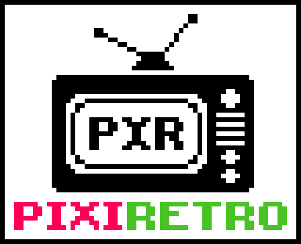

  

## What's this?

Pixiretro is a game engine I made to develop small pixel art retro arcade games like Pacman, Space Invaders :space_invader:, Snake :snake: and Donkey Kong.

## Features

## Compilation

run:

meson setup build

in project root dir

cd build/

meson compile

This will output a .so file which can be linked against in your game project.

## License
